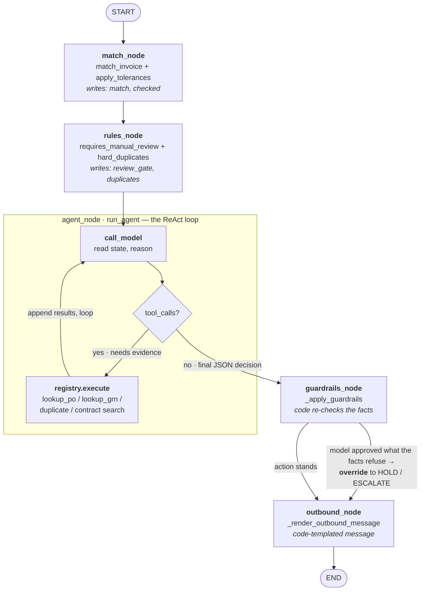

# The pipeline as a LangGraph

`decide_invoice` (`src/apagent/pipeline.py:56`) is our core flow: an invoice
goes in, a decision comes out, and between them sit five stages. Those stages
are a LangGraph state graph in everything but the import — a shared state, nodes
that read it and write back, and conditional edges that route on what the state
holds.

We hand-wrote the loop instead of building on LangGraph, and that is a
deliberate choice, not a gap. The whole demo is being able to say "the agent
called this tool, saw this result, then decided X because of Y" and walk it line
by line. A framework runtime is a black box; this is a glass box
(`src/apagent/agent/loop.py:1`). The concepts map exactly — this document is the
proof — and where our design differs from a stock LangGraph agent, it differs in
the direction the rubric cares about: code can overrule the model.

## The graph



## The mapping

| LangGraph concept | Our implementation | Where |
|---|---|---|
| **State** — shared memory across the graph | the case bundle: `invoice → po/grn → match → checked (tolerances) → review_gate → duplicates → decision → guardrails` | `api/service.py:get_case` assembles it |
| **Node** — reads state, does a job, writes back | `match_node`, `rules_node`, `agent_node`, `guardrails_node`, `outbound_node` | `pipeline.py:78-108` |
| **Conditional edge** — routes on the current state | (1) the agent's tool loop: reason → *needs a tool?* → call → back; (2) the guardrails override: *did the model approve something the facts refuse?* | `loop.py:118`, `pipeline.py:_apply_guardrails` |
| **Runtime** — walks the graph, prevents infinite loops | the `max_rounds` cap that force-stops a stuck agent and escalates | `loop.py:92`, `:214` |

The two conditional edges are the two routings LangGraph most wants to teach.
The first is the canonical agent↔tools loop — the exact shape of the §4 diagram.
The second is ours: a code gate that can reverse the model.

## agent_node in detail — the only live node

`match_node` and `rules_node` are pure computation; `guardrails_node` and
`outbound_node` are pure code. `agent_node` (`run_agent`, `loop.py:44`) is the
one place the LLM runs, and it is a ReAct loop by hand.

It receives the facts already computed — line pairings, price and quantity
deltas, the tolerance verdicts, whether a duplicate exists, whether the amount
is over the review threshold — packed into one task message. Its job is not to
recompute any of that; it is to judge what the facts mean and gather any missing
evidence with tools. Each round:

```
for round in 1..max_rounds:
    response = call_model(messages, tools, system)
    if no tool_calls:            # the model is done
        parse the JSON decision and return it
    else:                        # the model wants evidence
        run each tool, append the results, loop
```

That `if / else` is the conditional edge. The `else` branch running a tool and
returning to the top is the `tools → agent` back-edge. Four details are worth
pointing at on the slide:

- **Every tool call is recorded** with its round, arguments and result
  (`loop.py:195`). That history is the glass box — it is exactly what the
  console's tool-trail column renders.
- **`max_rounds` is the Runtime.** Hanging is worse than escalating: a stuck
  agent blocks the whole queue, so after five rounds we force-return `ESCALATE`
  with the tool history attached (`loop.py:214`). LangGraph's runtime prevents
  infinite loops for you; here it is one `for` bound.
- **One JSON-format retry.** Live DeepSeek runs write a prose analysis and put
  the JSON after it, so we scan for the last object carrying an `action` key
  rather than requiring the whole reply to be JSON, and nudge once if that fails
  (`loop.py:_extract_decision_json`). This is a real bug from a real demo run,
  not a hypothetical.
- **Always the same shape.** Even on error the node returns an `AgentDecision`
  with `action=ESCALATE`, so the caller never handles a special case.

## The edge that makes us different

In a stock LangGraph agent the model's decision is the graph's output. Here it
is not. `agent_node` only *recommends*; the very next node, `guardrails_node`,
re-derives the facts in code and can overrule an unjustified `APPROVE`
(`pipeline.py:101`). The percentage a contract allows is re-parsed by code before
it is enforced, the money threshold is a hard gate, and a duplicate is a
computed fact — none of it depends on whether the model reasoned correctly.

That is the answer to "why not just use LangGraph". The deck's own guidance is
to reach for LangGraph "when you need strict step-by-step rules and workflows
where you can't afford mistakes". Paying a supplier is exactly that, and our
strict rule is stronger than routing: it is a deterministic gate that reverses
the model. We express it in code so it is auditable line by line, which is the
same reason the loop is hand-written. The graph shape is LangGraph's; the
authority stays in code.

## Not just a diagram — a runnable graph

`src/apagent/graph.py` is this document as code: a real `StateGraph` whose five
nodes call the same stage functions `decide_invoice` calls, so it is an
orchestration view over the existing pipeline, not a second implementation that
could drift. It is an optional dependency — the core system never imports it.

```bash
pip install -e ".[langgraph]"
python -m apagent.graph          # prints LangGraph's own mermaid of our pipeline
```

`build_graph(store, registry, ...).invoke({"invoice": inv})` runs the whole flow
and returns the same decision as `decide_invoice`. A test
(`tests/test_graph.py`) pins that equivalence across five invoices — the
headline contract-flip, an over-tolerance hold, a missing-GRN hold, the
duplicate, and a clean approve — by stubbing the LLM identically on both paths,
so any drift in the wiring fails the build. The `guardrails → outbound` edge is
a genuine `add_conditional_edges` call: only `HOLD` and `EMAIL` carry a
code-templated message, and the graph routes on that.
